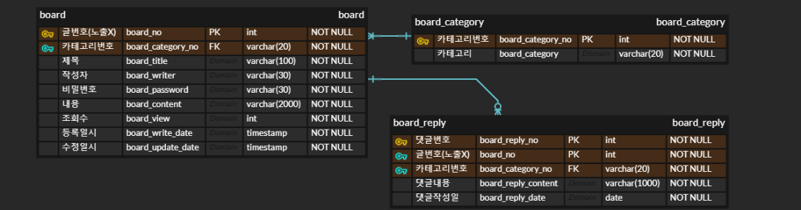

# Servlet 활용 게시판

## Intro

- model1 방식 게시판을 Servlet 게시판으로 refactoring 한 게시판입니다.
- MVC 패턴을 적용하며 커맨드 패턴을 활용하여 각 기능들을 API 형태로 구현 했습니다.
- Controller  에서는 서비스를 호출하는 최소한의 기능만 수행 할 수 있도록 하고자 했습니다.
- MyBatis를 사용하여 로직을 간소화 하였습니다.
- 게시판 서비스 이용시 각 게시글들은 비밀번호 검증을 합니다.

## Tech Stack

- JSP/Servlet
- gradle
- mySQL
- myBatis
- Javascript

## ERD

- 게시판 ERD 입니다.
- 카테고리와 게시글 테이블을 따로 분리하여 생성, 추가, 삭제에 용이하도록 했습니다.

## Service

- **action** 을 통해 각각의 기능들을 수행합니다.
- **prefix** : `/board`
- 게시글 목록 `?action=list`
- 게시글 생성 `?action=write`
- 게시글 조회`?action=read`
- 게시글 수정 `?action=update`
- 게시글 삭제 `?action=delete`
- 댓글 생성`?action=reply`
- 댓글 목록 `?action=replyList`

## Service Process

- **action** 파라미터를 통해 각 Service를 실행합니다.
  - Controller는 단순히 action 구분을 통해 서비스를 호출하는 기능만 수행합니다.
  - doGet(), doPost()를 사용하지 않습니다.

- DAO는 쿼리 호출기능만 할수 있도록 최소화했습니다. 

## Trouble Shooting

- 해당 프로젝트를 수행하며 인상 깊었던 오류에 대한 기록입니다.

**Mybatis로 전환하며 생긴오류**

- **증상**
  - myBatis 전환하게 되며 데이터는 존재하지만 화면에 표시되지 않는 오류가 발생했습니다.
- **원인**
  - VO와 쿼리결과가 매칭이 되지 않았습니다.
  - Sevlet 게시판 개발당시 db처리를 mybatis 활용하며 컬럼명을 mySQL에서 권장하는 **snake case**로 **refactoring**을 했기 때문입니다.
- **접근 방법 및 해결과정**
  - 가장 간단한 방법인 VO변수를 snake case로 모두 바꾸는 방법이 있지만 JAVA에서 권장하지 않는 문법이기에 사용하지 않았습니다.
  - VO변수들 각각에 결과를 담아주는 방법이 있었으나 코드가 길어지는 불편함이 있었습니다.
  - **snake case to camel case** 라는 myBatis 자체 도구를 검색을 통해 알게 되었습니다.
  - 해당 도구사용을통해 해결완료했습니다.
- **결론**
  - 간소하지만 명확하게 코드를 짜게되면 가독성이 매우 좋아짐을 체감하게 되었습니다.
  - 시간이 다소 걸리더라도 refactoring 과정이 반드시 필요함을 느꼈습니다.
  - 꾸준히 성장하며 짧지만 강력한 로직을 구현하는 개발자가 되고싶습니다.

**초기 Sevlet으로 구현 하게 되었을 때 POST요청 관련 오류**

- **증상**
  - 초기구현단계에서는 doGet() 메서드와 doPost() 메서드를 사용했습니다.
  - Post 요청시 요청을 수행하지 못하는 오류가 있었습니다.

- **원인**
  
  - 오타로 인해 발생했습니다.
  - 하지만 **Post** 와 **Get** 요청 그리고 **forward** 와 **redirect**에 더 많은 공부를 할수 있었기에 기록을 남깁니다.
  
- **접근 방법 및 해결과정**

  - 구글 검색을 통해 Post 요청은 `response.sendRedirect()` 를 사용하는 것으로 확인했습니다.
    - 보안상의 이유로 **forward** 를 사용하게 되면 요청정보가 페이지에 남기 때문입니다.
    - 하지만 데이터가 유실될 위험이 있습니다.
  - **redirect** 의 경우 브라우저에서 요청을 하고 결과를 받으면 다시 새로운 요청을 하여 결과를 받는 방식입니다.
    - 이전의 데이터는 사라지게 됩니다.

  - 참고자료
    - https://doublesprogramming.tistory.com/63
    - https://www.youtube.com/watch?v=2cfx6QunhiA
    - https://kimcoder.tistory.com/190

- **결론**

  - 단순히 오타로 인해 발생한 오류 였지만 Web의 동작원리에 대해 더 알게된 계기가 되었습니다.
  
  
