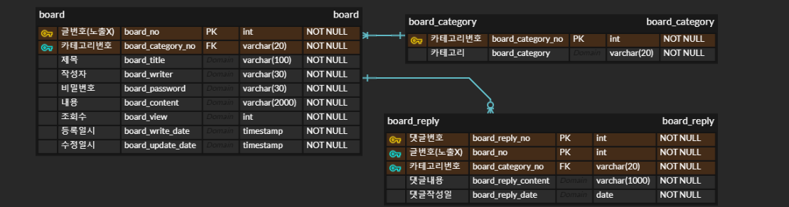
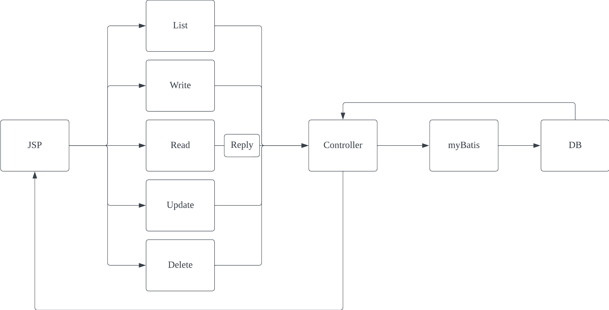
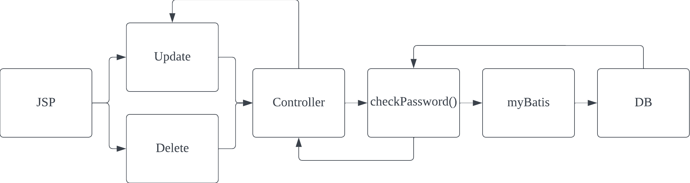

# Spring boot 활용 게시판

## Intro

- Servlet 게시판을 Spring boot를 사용하여 refactoring 한 게시판입니다.
- 게시글 읽기, 쓰기, 수정, 목록, 댓글 읽기, 쓰기의 기능을 가지고 있습니다.
- 각게시글 수정, 삭제시 DB와 연동하여 비밀번호를 검증 합니다.

## Tech Stack

- Spring boot
- JSP
- mySQL
- gradle
- myBatis

## ERD

- ERD는 Servlet 게시판과 동일 합니다.

## Service Process

- 기본적인 API 호출 및 응답 과정입니다.

- 비밀번호 확인 과정입니다.

## API

- 메인페이지 `GET /`

- 글 목록 `GET /list`
- 글 쓰기 양식 `GET /write`
- 글 작성 `POST /write`
- 글 읽기 `GET /read`
  - 댓글목록 메서드를 함께 호출합니다.
- 글 수정 양식 `GET /update`
- 글 수정 `POST /update`
  - 글 수정전 passwordCheck 메서드를 사용하여 비밀 번호를 확인합니다.
- 글 삭제 `POST /delete`
  - 글 삭제 역시 passwordCheck 메서드를 사용하여 비밀 번호를 확인합니다.
- 댓글 쓰기 `POST /replyWrite`

## Truoble Shooting

