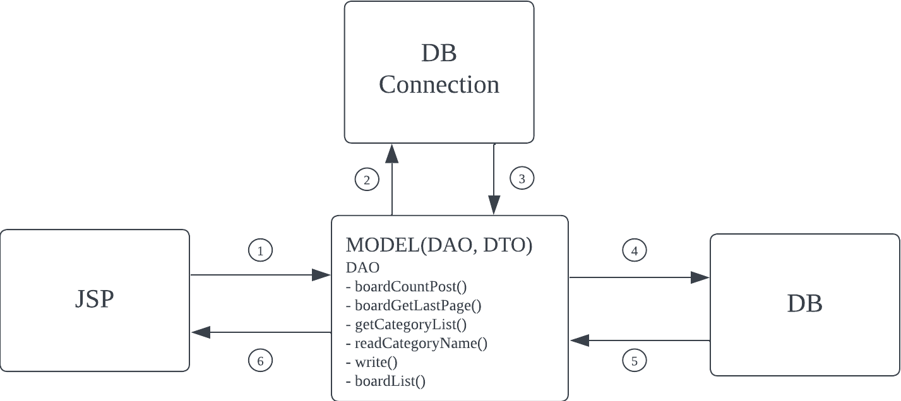
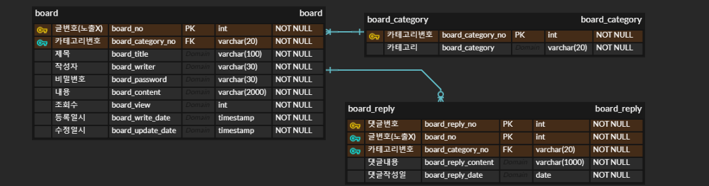

# Board Project

## Intro

- eBrainSoft에서 운영하는 study 모임을 가지며 수행한 게시판 프로젝트입니다.
- model 1 방식을 사용하여 CRUD게시판을 구현했습니다.
- 화면설계서를 바탕으로 데이터 구조설계부터 기능구현 까지 혼자 수행했습니다.
- 참고영상
  - 링크 : https://www.youtube.com/watch?v=wEIBDHfoMBg

## Tech Stack

- JAVA
- jsp
- javscript

## Srervice Process

- 게시판 서비스 흐름도 입니다.

## ERD

- 게시판 ERD입니다.

  